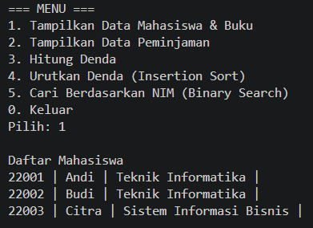
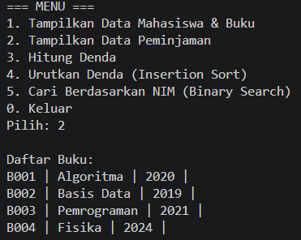
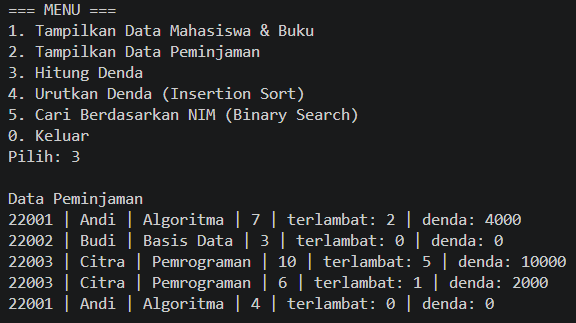
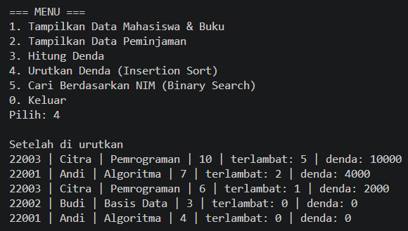

|  | Algorithm and Data Structure |
|--|--|
| NIM |  254107020229|
| Nama | Nurfakiyah Rahmadhani |
| Kelas | TI - 1F |
| Repository | [link] (https://github.com/borzooraa/PraktikumASD/tree/main/Jobsheet%201) |

# Labs # CASE METHOD 1

### Hasil Running
untuk hasil outputan setiap output dapat dilihat seperti di bawah inii:
1. Menu 1 

2. Menu 2

3. Menu 3

4. Menu 4 

5. Menu 5

! [Screenshot](img/M5.png)

6. Menu 0 

! [Screenshot](img/M0.png)