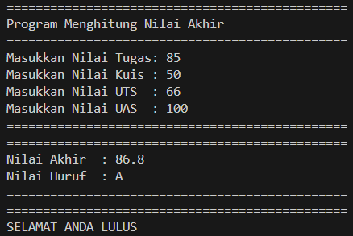
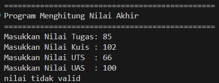
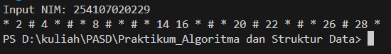
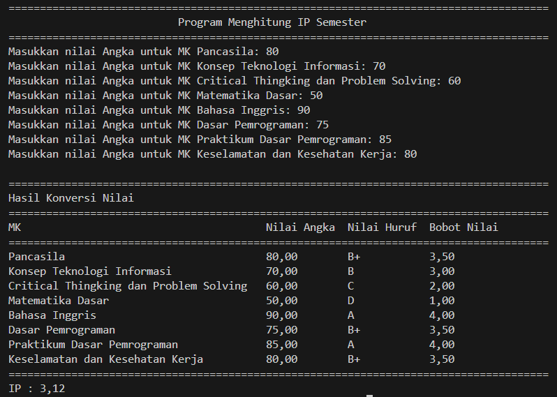
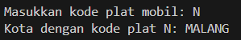
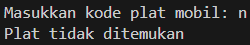
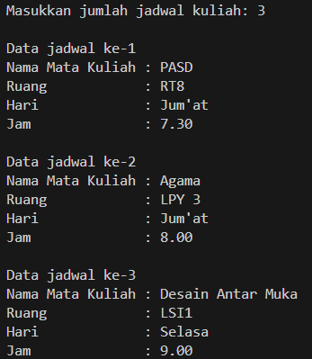
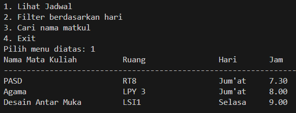
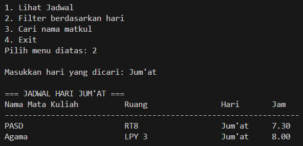
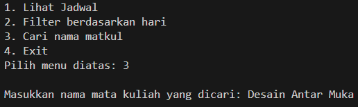

|  | Algorithm and Data Structure |
|--|--|
| NIM |  254107020229|
| Nama | Nurfakiyah Rahmadhani |
| Kelas | TI - 1F |
| Repository | [link] (https://github.com/borzooraa/PraktikumASD/Jobsheet1) |

# Labs #1 Programming Fundamentals Review

## 1.1. Selection Solution

The solution is implemented in pemilihan23.java, and below is screenshot of the result.

**Brief explanation:** There are 5 main step: 
1. Input the grades for assignment, quiz, medterm exam, and final exam
2. Check wether all input values are valid (between 0 and 100)
3. Calculate the final score using the weighted formula
4. Convert the final score into a letter grade
5. Determine wether the stundent passed or fails based on the letter

## 1.2. Looping Solution
The solution is implemented in perulangan23.java, and below is screenshot of the result.

**Brief explanation** There are 6 steps:
1. Input the student ID number (NIM)
2. Take the last two digits of the NIM to determine the number of iterations
3. If the result is less than 10, add 10 to it
4. Repeat a process from 1 up to that number
5. Skip printing when the number is 10 or 15
6. Print “#” for multiples of 3, the number itself for even numbers, and “*” for odd numbers

## 1.3 Array  Solution
the solution is implemented in array23.java, and below is screenshot of the result. 

**Brief explanation** There are 6 steps:
1. Display a list of courses along with their credit units (SKS)
2. Input the numeric grade for each course
3. Convert each numeric grade into a letter grade and its equivalent grade point
4. Multiply the grade point by the course credits to obtain the weighted score
5. Calculate the Semester GPA (IP) by dividing the total weighted score by the total credits
6. Display the conversion results for all courses and the final GPA

## 1.4 Function Solution
the solution is implemented in function23.java, and below is screenshot of the result. 

**Brief explanation** There are 5 steps:
1. Store the stock data of products for each branch in a two-dimensional array
2. Define the price of each product
3. Calculate the total revenue for each branch by multiplying stock and price
4. Determine the performance status based on the revenue amount
5. Display the revenue and status for each branch

## 1.5 Assignment 1
the solution is implemented in tugas1.java, and below is screenshot of the result. 

**Brief explanation** There are 5 steps:
1. Input a vehicle license plate code (a single letter)
2. Compare the input with a list of valid plate codes stored in an array
3. If a match is found, retrieve the corresponding city name from a two-dimensional array
4. Combine the characters to form the full city name
5. Display the city associated with the plate code, or show a message if the code is not found

## 1.6 Assignment 2
the solution is implemented in tugas2.java, and below is screenshot of the result. 

**Brief explanation** There are 5 steps:
1. Input the number of class schedules to be stored
2. Enter the details for each schedule, including course name, room, day, and time
3. Store all schedule data in a two-dimensional array
4. Display a menu with options to view all schedules, filter by day, search by course name, or exit
5. Show the requested schedule information based on the user’s menu selection

