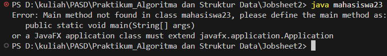
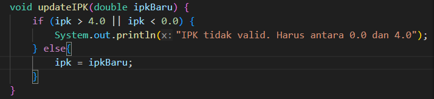
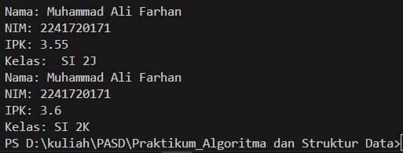
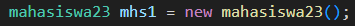
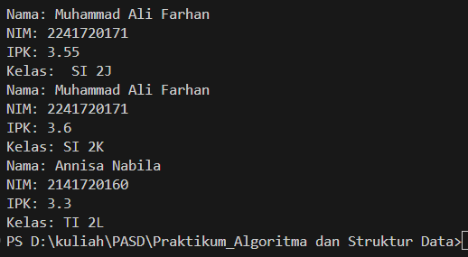

|  | Algorithm and Data Structure |
|--|--|
| NIM |  254107020229|
| Nama | Nurfakiyah Rahmadhani |
| Kelas | TI - 1F |
| Repository | [link] (link) |

# Labs #1 OBJECT

## 1.1. Percobaan 1
untuk hasil running program pada percobaan 1 yaitu seperti pada gambar di bawah ini

Jawaban pertanyaan:
1. Memiliki method dan atribut.
2. Ada 4 (nama, nim, kelas, ipk).
3. Ada 4 (tampilkanInformasi, ubahKelas, updateIpk, nilaiKinerja).
4. 
5. Cara method tersebut bekerja yaitu program akan memvalidasi kondisi nilai ipk, jika nilai ipk lebih dari sama dengan 3.5 maka program akan me return "Kinerja sangat baik"; kemudian jika nilai tersebut tidak memnuhi kondisi pertama maka akan ada pengecekan kedua dengan batas lebih dari sama dengan 3.0 dan program akan me-return "Kinerja baik" jika kondisi memenuhi; jika nilai tersebut tetap tidak memenuhi kondisi kedua maka akan ada pemvalidasian dengan batas lebih dari sama dengan 2.0 dan akan mereturn "Kinerja cukup" jika kondisi memenuhi; dan jika nilai tetap tidak memenuhi ketiga kondisi di atas maka program akan me-return "Kinerja kurang".

## 1.2. Percobaan 2
untuk hasil running program pada percobaan 2 yaitu seperti pada gambar di bawah ini

Jawaban pertanyaan:
1. baris program yang menunjukkan proses instansiasi yaitu:

nama object yang dihasilkan yaitu mhs1.
2. namaObject.namaAtribut, dan namaObject.namaMethod().
3. Karena pada method tersebut, yang pertama memanggil hasil yang sebelum di ubah. Sementara pada program tersebut terlihat setelah pemanggilan pada method pertama dilakukan perubahan pada atribut class dan ipk yang membuat hasil outputan berbeda antara method tampilkanInformasi() pertama dan kedua.

## 1.3. Percobaan 3
untuk hasil running program pada percobaan 3 yaitu seperti pada gambar di bawah ini

Jawaban pertanyaan:
1. 
2. Pengisian argumen
3. Hasil runningnya yaitu

Hal ini dikarenakan ketika kita membuat konstruktor yang berparameter java tidak akan membuat konstruktor kosong secara otomatis.
4. Tidak, hal ini dikarenakan methot dapat diakses dari namanya terlepas dari urutannya.
5. ae

## 1.4. Latihan Praktikum 
### 1.4.1 Latihan 1
### 1.4.2 Latihan 2