|  | Algorithm and Data Structure |
|--|--|
| NIM |  254107020229|
| Nama | Nurfakiyah Rahmadhani |
| Kelas | TI - 1F |
| Repository | [link] (https://github.com/borzooraa/PraktikumASD/tree/main/Jobsheet3) |

# Labs #3 OBJECT

## 3.1 Perccobaan 1 (Membuat Array dari Object, mengisi dan Menampilkan)
### 3.1.1 Hasil percobaan
Hasil run pada percobaan pertama yaitu seperti pada di bawah ini:

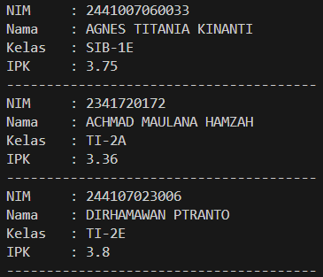

Hasil yang sama seperti pada jobsheets praktikum

### 3.1.2 Jawaban pertanyaan:
1. Class yang akan dijadikan array of object tidak harus memiliki atribut maupun method. Namun biasanya class memiliki atribut untuk menyimpan data dan method untuk mengolah data agar objek yang dibuat memiliki fungsi yang jelas.
2. Kode tersebut digunakan untuk membuat sebuah array yang dapat menampung 3 objek bertipe Mahasiswa. Namun setiap elemen dalam array tersebut masih bernilai null karena objek Mahasiswa belum dibuat.
3. Pada class tersebut tidak memiliki konstruktor, hal yang menyebabkan mengapa baris program tersebut dapat melakukan pemanggilan adalah karena java akan otomatis membuat konstruktor kosong jika kita tidak membuat sebuah konstruktor
4. Yang dilakukan pada kode program tersebut yaitu, menginstansiasi object pada indeks 0 serta mengisi atribut objek tersebut yaitu nim, nama, kelas, dan ipk. s
5. Kedua class tersebut dipisahkan agar program lebih terstruktur dan mudah dipahami. Class mahasiswa_23 digunakan untuk mendefinisikan atribut dan data mahasiswa, sedangkan MahasiswaDemo23 digunakan sebagai class utama untuk menjalankan program. Selain itu, di java dalam satu fie hanya bisa memiliki satu class yang bersifat public, sehingga pemisahan class ke fille yang berbeda membantu menghindari error saat kompilasi.

## 3.2 Percobaan 2 (Menerima Input Isian Array Menggunakan Looping)
### 3.2.1 Hasil percobaan
Hasil run pada percobaan kedua yaitu seperti pada di bawah ini

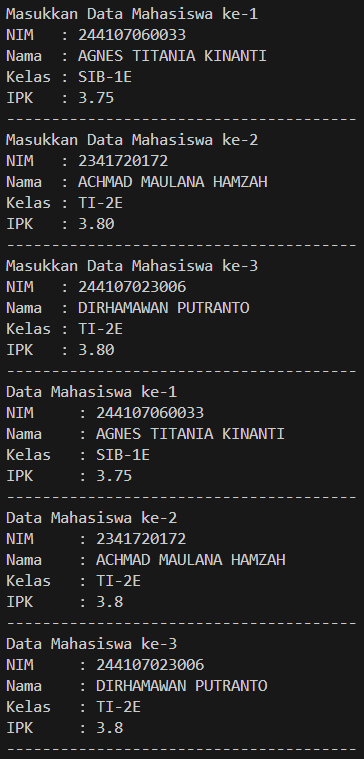

Hasil yang sama seperti pada jobsheets praktikum

### 3.2.2 Jawaban pertanyaan:
1. Menambahkan method cetakInfo() dan memodifikasi program, yaitu seperti pada contoh di bawah ini.
menambahkan method cetakInfo() pada class mahasiswa_23

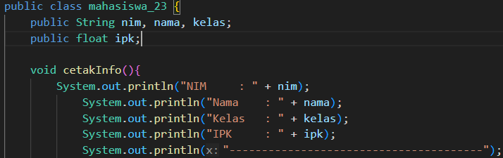

memodifikasi for-loop pada class mahasiswaDemo

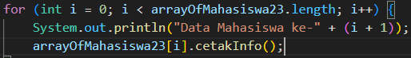

dengan hasil seperti pada di bawah ini:

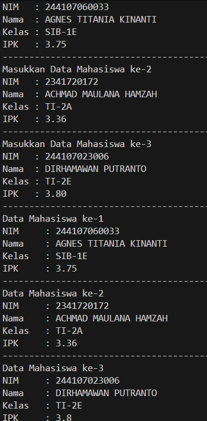

dimana hasilnya sama dengan hasil running pada percobaan 2
2. Yang menyebabkan program tersebut error adelah karena belum ada object pada erray tersebut, dimana seharusnya object di inisialisasikan di awal dengan menggunakan command 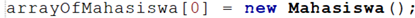
jika tidak dilakukan instansiasi maka nilai dari array tersebut adalah null yang menyebabkan ada error "error (NullPointerException)"

## 3.3 Percobaan (Constructor Berparameter)
### 3.3.1 Hasil percobaan
Hasil run pada percobaan ketiga yaitu seperti pada di bawah ini

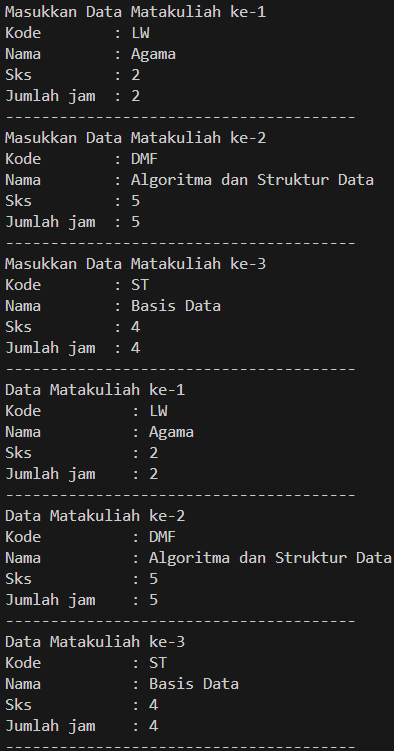

dimana hasilnya mirip dengan di jobsheet (saya ubah inputannya saja)

###  3.3.2 Jaban pertanyaan:
1. Satu class bisa memiliki lebih dari satu  constructor, dengan catatan kedua constructor tersebut memiliki parameter yang berbeda yang berbeda. untuk contonya bisa kita lihat pada jobsheet sebelumnya, pada class mahasiswa23 yaitu

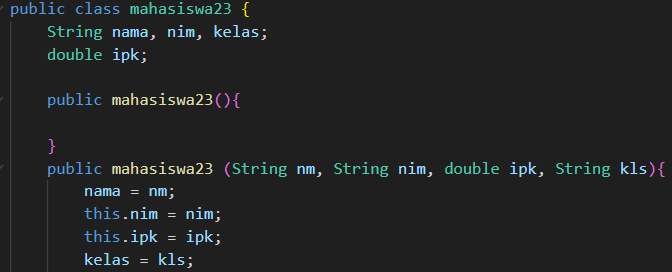

2. Menambahkan method tambahData pada class mata_Kuliah23 yaitu dapat dilakukan seperti pada di bawah ini:

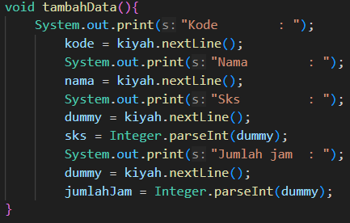

dan menggunakan method tersebut di dalam class MataKuliahDemo23 untuk menambahkan data dapat dilakukan seperti pada gambar di bawah ini:

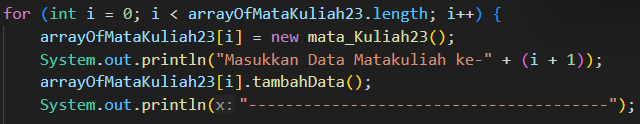

dengan hasil dari program tersebut yaitu

3. menambahkan method cetakInfo() pada class mata_Kuliah23 yaitu dapat dilakukan seperti kode di bawah ini:

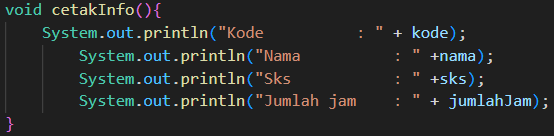

kemudian menggunakan method tersebut pada class mataKuliahDemo seperti:

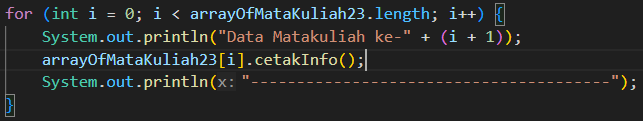

dimana hasil runningnya berupa:
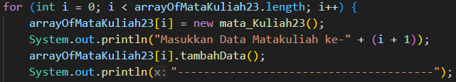

4. Mempdifikasi program agar jumlah elemen dari array of object teersebut ditentukan oleh user dapat dilihat seperti pada di bawah ini

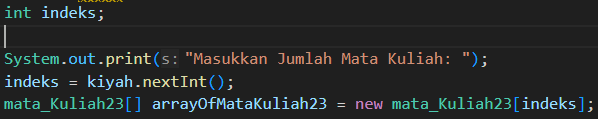

dimana pada program tersebut, indek yang mulanya [i] diganti menjadi [indeks] dimana kita menambahkan variable indeks dan memasukkan jumlah elemen menggunakan scanner di awal. 
Untuk hasil runningnya seperti di bawah ini:

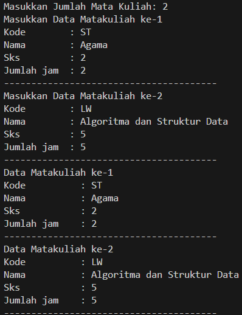

## 3.4 Tugas
1. Hasil running tugas pertama:

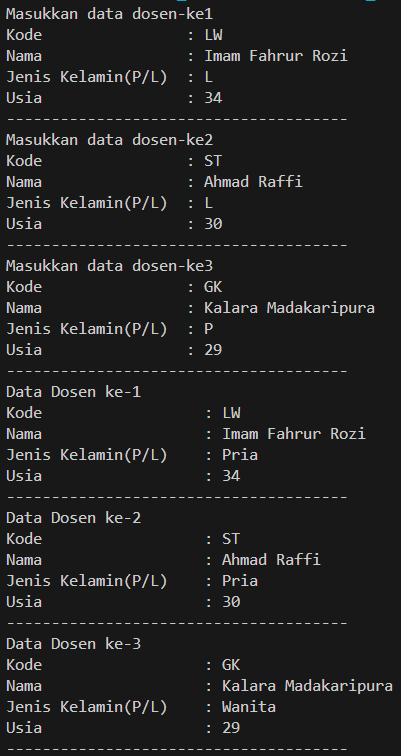

2. Hasil running tugas kedua (Saya bagi-bagi setiap method):
input data dosen

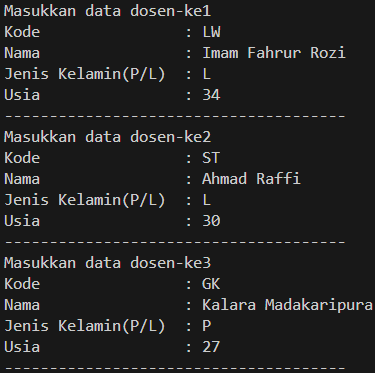

data dosen

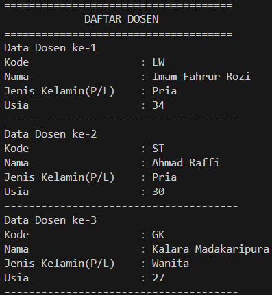

jumlah dosen berdasarkan jenis kelamin

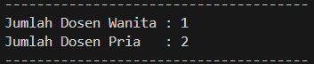

rata-rata usia berdasarkan jenis kelamin

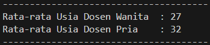

dosen termuda

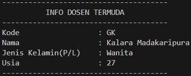

dosen tertua

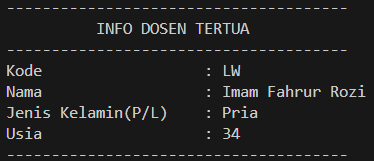

