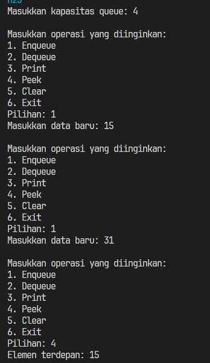
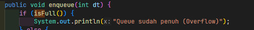
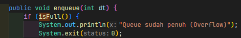
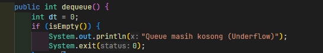
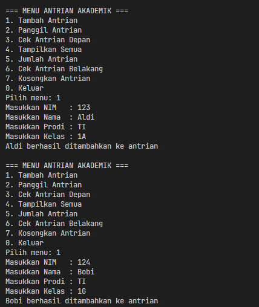
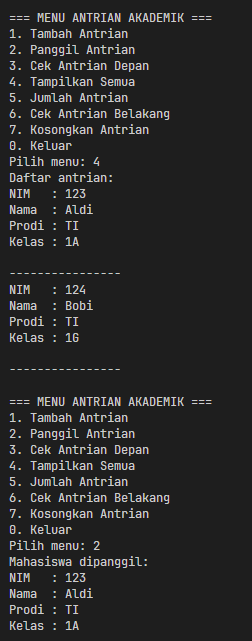
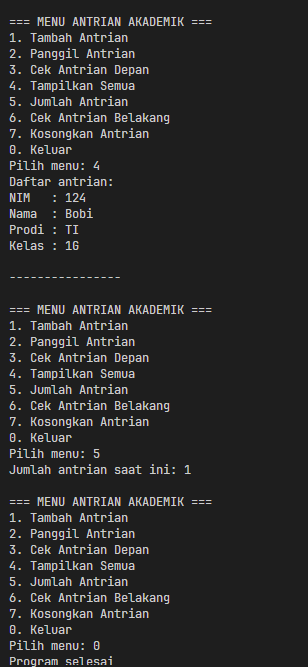

|  | Algorithm and Data Structure |
|--|--|
| NIM |  254107020229|
| Nama | Nurfakiyah Rahmadhani |
| Kelas | TI - 1F |
| Repository | [link] (https://github.com/borzooraa/PraktikumASD/tree/main/jobsheet10) |

# Labs #10 Queue
## 10.1 Percobaan 1

 ### 10.1.1 Pertanyaan
 1. Mengapa nilai awal atribut front dan rear bernilai -1, sementara atribut size bernilai 0?
 : Atribut front dan rear bernilai -1 sebagai penanda/indikator bahwa Queue masih kosong dan belum menunjuk ke indeks array mana pun (karena indeks array dimulai dari 0). Sementara size bernilai 0 karena jumlah elemen yang tersimpan di dalam Queue memang masih belum ada.
 2. Maksud dan kegunaan potongan kode pada method Enqueue
 :Kegunaannya adalah untuk mengatur posisi front (elemen terdepan) ke indeks 0 ketika data pertama kali dimasukkan ke dalam Queue yang tadinya kosong.
 3. Maksud dan kegunaan potongan kode pada method Dequeue
 : Kegunaannya adalah untuk mereset kembali nilai front dan rear menjadi -1 apabila setelah proses pengeluaran data (dequeue), Queue tersebut menjadi benar-benar kosong (tidak ada elemen tersisa).
 4. Mengapa pada proses perulangan variabel i tidak dimulai dari 0 melainkan int i=front?
 : Karena posisi elemen terdepan di dalam Queue tidak selalu berada di indeks 0 akibat proses dequeue yang menggeser nilai front. Oleh karena itu, pencetakan harus dimulai dari posisi front saat ini.
 5. Maksud dari potongan kode pada method print
 : Kode ini digunakan untuk mengubah posisi indeks i secara melingkar (circular array). Ketika nilai i sudah mencapai batas maksimum array (max - 1), operasi % max akan mengembalikan nilai i ke indeks 0.
 6. Potongan kode program yang merupakan queue overflow:

 

 7. Modifikasi program dihentikan saat overflow dan underflow:

 
 
 

## 10.2 Percobaan 2

 ### 10.2.1 Pertanyaan
 

 