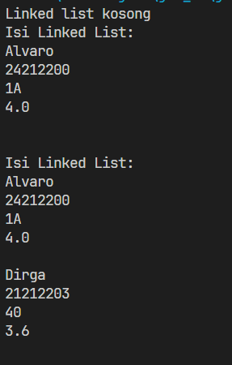
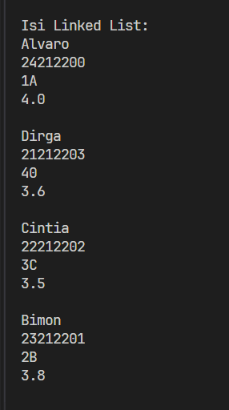

|  | Algorithm and Data Structure |
|--|--|
| NIM |  254107020229|
| Nama | Nurfakiyah Rahmadhani |
| Kelas | TI - 1F |
| Repository | [link] (https://github.com/borzooraa/PraktikumASD/tree/main/jobsheet11) |

# Labs #11 Singe Linked List
## 11.1 Percobaan 1

 ## 11.1.2 Pertanyaan
 1. Mengapa hasil compile kode program di baris pertama menghasilkan “Linked List Kosong”?
 : Karena saat pertama kali sll.print() dipanggil, linked list masih belum berisi data apa-apa
 2. Jelaskan kegunaan variable temp secara umum pada setiap method!
 : temp digunakan untuk bergeser satu per satu menelursuri linked list tanpa mengubah posisi head nya
 3. Lakukan modifikasi agar data dapat ditambahkan dari keyboard!