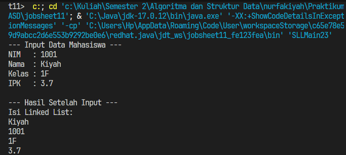
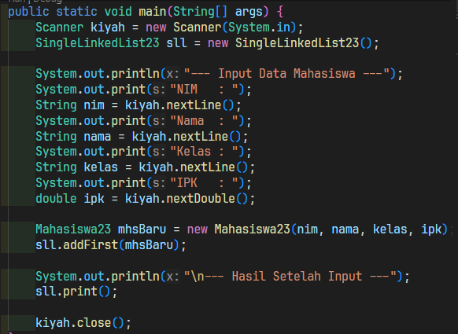
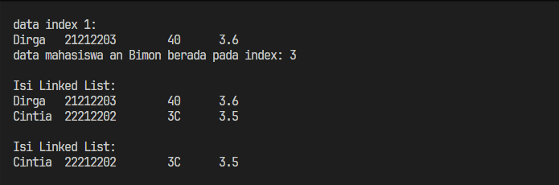
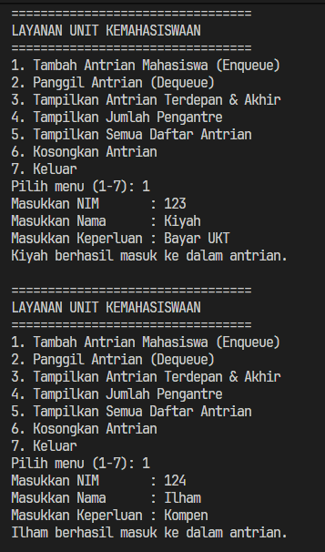
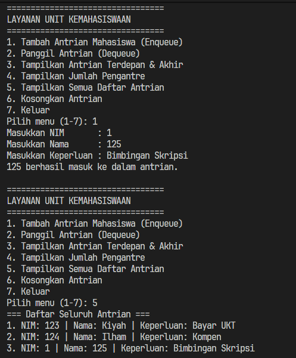
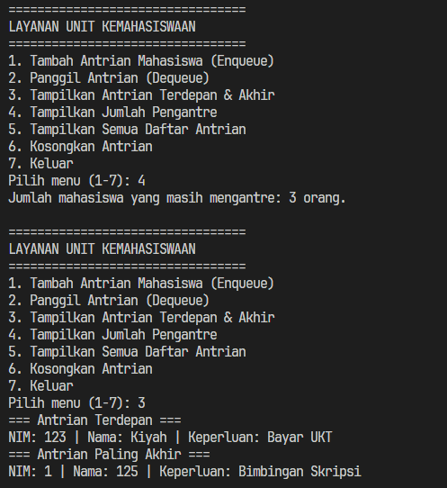
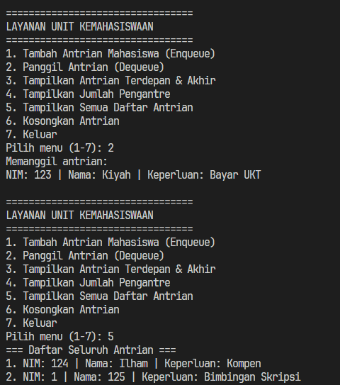
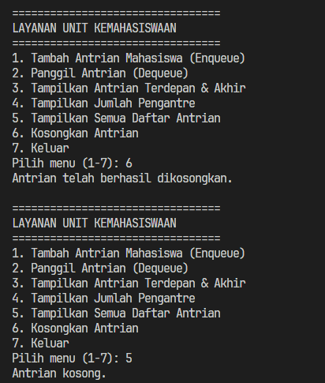

|  | Algorithm and Data Structure |
|--|--|
| NIM |  254107020229|
| Nama | Nurfakiyah Rahmadhani |
| Kelas | TI - 1F |
| Repository | [link] (https://github.com/borzooraa/PraktikumASD/tree/main/jobsheet11) |

# Labs #11 Singe Linked List
## 11.1 Percobaan 1

 ## 11.1.2 Pertanyaan
 1. Mengapa hasil compile kode program di baris pertama menghasilkan “Linked List Kosong”?
 : Karena saat pertama kali sll.print() dipanggil, linked list masih belum berisi data apa-apa
 2. Jelaskan kegunaan variable temp secara umum pada setiap method!
 : temp digunakan untuk bergeser satu per satu menelursuri linked list tanpa mengubah posisi head nya
 3. Lakukan modifikasi agar data dapat ditambahkan dari keyboard!

 

 

## 11.2 Percobaan 2

 ### 11.2.1 Pertanyaan
 1. Mengapa digunakan keyword break pada fungsi remove? Jelaskan!
 : Keyword break digunakan untuk menghentikan proses perulangan (while) secara paksa setelah node yang dicari (berdasarkan key) berhasil ditemukan dan dihapus. Karena setiap mahasiswa memiliki nama atau identitas unik dalam kasus ini, setelah data yang cocok dihapus, kita tidak perlu lagi melanjutkan penelusuran sisa node di dalam linked list, sehingga dapat menghemat waktu eksekusi program
 2. Jelaskan kegunaan kode dibawah pada method remove!
 : temp.next = temp.next.next; : Baris ini berfungsi untuk menghapus node target dengan cara melompati (memutus hubungan) node tersebut. Pointer next dari node sebelum target (temp) langsung diarahkan ke node setelah target (temp.next.next), sehingga node target terlepas dari rangkaian list.  if (temp.next == null) { tail = temp; } : Kondisi ini digunakan untuk mengecek apakah node yang baru saja dihapus berada di posisi paling belakang. Jika setelah dihapus ternyata temp.next bernilai null (tidak ada node lagi di depannya), berarti temp sekarang menjadi node terakhir, sehingga atribut tail harus diperbarui untuk menunjuk ke temp

## Tugas

