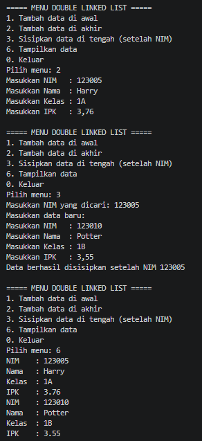
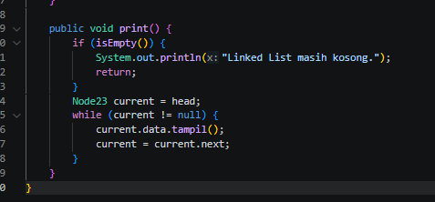
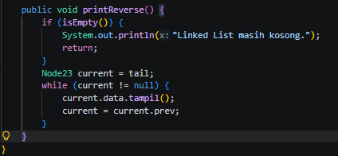

|  | Algorithm and Data Structure |
|--|--|
| NIM |  254107020229|
| Nama | Nurfakiyah Rahmadhani |
| Kelas | TI - 1F |
| Repository | [link] (https://github.com/borzooraa/PraktikumASD/tree/main/jobsheet12) |

# Labs #12 Double Linked List
## 12.1 Percobaan 1

 

 ## 12.1.2 Pertanyaan
 1. Jelaskan perbedaan struktur dan mekanisme traversal antara Single Linked List dan Double Linked List!
 : Single Linked List hanya memiliki satu pointer yaitu `next`, sehingga node hanya terhubung ke node setelahnya dan traversal hanya bisa dilakukan dari depan ke belakang. Pada Double Linked List, setiap node memiliki dua pointer yaitu `next` dan `prev`, sehingga node terhubung ke node setelah dan sebelumnya. Karena itu traversal pada Double Linked List dapat dilakukan dua arah, maju maupun mundur. Selain itu, proses penyisipan dan penghapusan node pada Double Linked List lebih mudah karena dapat langsung mengakses node sebelumnya tanpa harus menelusuri ulang dari awal.

2. Perhatikan class Node, di dalamnya terdapat atribut next dan prev. Jelaskan fungsi
masing-masing atribut tersebut pada proses traversal dan manipulasi node!
: Atribut `next` berfungsi menyimpan alamat node berikutnya agar proses traversal bisa bergerak maju ke node selanjutnya. Sedangkan atribut `prev` berfungsi menyimpan alamat node sebelumnya agar traversal bisa bergerak mundur ke node sebelumnya. Dalam manipulasi data, kedua atribut ini digunakan untuk menjaga hubungan antar node saat melakukan penambahan, penghapusan, atau pemindahan node agar struktur linked list tetap tersambung dengan benar.

3. Perhatikan konstruktor pada class DoubleLinkedList. Jelaskan fungsi konstruktor tersebut
terhadap kondisi awal linked list!
: Konstruktor pada class DoubleLinkedList berfungsi untuk menginisialisasi kondisi awal dari struktur data saat objek linked list pertama kali dibuat. Konstruktor ini mengatur atribut head dan tail agar bernilai null. Hal ini menandakan bahwa pada kondisi awal, linked list tersebut masih kosong dan belum memiliki node sama sekali.

4. Mengapa head dan tail Menunjuk Node yang Sama Saat Kosong?
: Ketika linked list berada dalam kondisi kosong dan sebuah node baru ditambahkan, maka node baru tersebut secara otomatis menjadi satu-satunya elemen di dalam linked list. Karena hanya ada satu node, node tersebut bertindak sebagai elemen pertama sekaligus elemen terakhir. Oleh karena itu, pointer head (awal) dan tail (akhir) harus menunjuk ke node yang sama untuk menjaga validitas struktur linked list

5. Modifikasi Method print()
: 

6. Modifikasi Kode Program: Menambahkan Method
:

