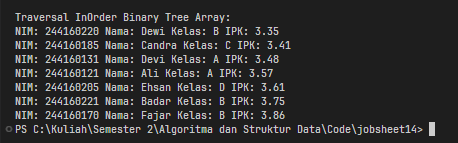
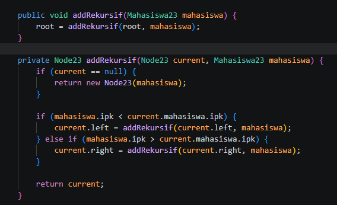
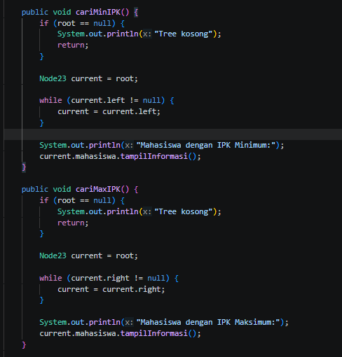
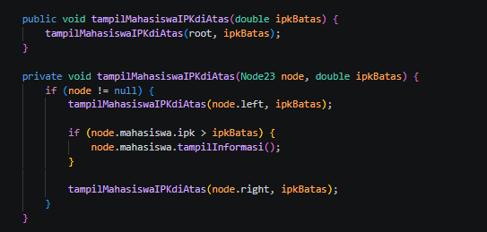
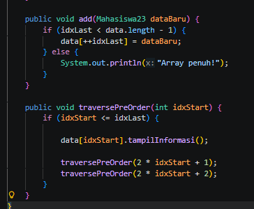

|  | Algorithm and Data Structure | 
|--|--|
| NIM | 254107020229 |
| Nama | Nurfakiyah Rahmadhani |
| Kelas | T1 - 1F |
| Repository | [link] (https://github.com/borzooraa/PraktikumASD/tree/main/jobsheet14) |

# Labs 14 Tree

## 14.1 Percobaan 1

### 14.1.1 Pertanyaan

1. Binary Search Tree menerapkan aturan bahwa nilai yang lebih kecil dari parent ditempatkan di sisi kiri, sedangkan nilai yang lebih besar berada di sisi kanan. Dengan susunan seperti ini, proses pencarian menjadi lebih cepat karena tidak perlu memeriksa seluruh node.

2. Atribut `left` dan `right` berfungsi sebagai penghubung antar node. `left` menunjuk ke anak kiri, sedangkan `right` menunjuk ke anak kanan sehingga struktur tree dapat terbentuk.

3.  
   a. `Root` merupakan node pertama atau node yang berada pada posisi paling atas dalam sebuah tree. Seluruh proses pencarian maupun penelusuran tree selalu dimulai dari node ini.

   b. Ketika tree baru dibuat, nilai `root` masih `null` karena belum terdapat data yang dimasukkan.

4. Jika tree masih kosong, node pertama yang ditambahkan akan langsung menjadi `root` karena belum ada node lain yang menempati posisi tersebut.

5. Potongan program tersebut berfungsi menentukan posisi node baru. Jika IPK yang dimasukkan lebih kecil daripada IPK node saat ini, maka proses akan berpindah ke subtree kiri. Sebaliknya, apabila nilainya lebih besar, proses akan berpindah ke subtree kanan.

6. 
   1. Menentukan node yang akan dihapus.
   2. Setelah node ditemukan, program mencari node pengganti (*successor*) menggunakan method `getSuccessor()`.
   3. Successor merupakan node dengan nilai terkecil pada subtree sebelah kanan.
   4. Posisi node yang dihapus digantikan oleh successor.
   5. Hubungan antara parent dan child diperbarui agar struktur Binary Search Tree tetap valid.
   6. Node successor yang sebelumnya berada di posisi asal kemudian dihapus.

---

## 14.2 Percobaan 2

### 14.2.1 Pertanyaan

1. **Kegunaan `data` dan `idxLast`**

   - `data` digunakan untuk menyimpan seluruh node binary tree dalam bentuk array.
   - `idxLast` berfungsi sebagai penanda indeks terakhir yang masih berisi data.

2. **Kegunaan `populateData()`**

   Method `populateData()` digunakan untuk mengisikan data ke dalam array binary tree sekaligus menetapkan nilai `idxLast` sesuai indeks terakhir yang terisi.

3. **Kegunaan `traverseInOrder()`**

   Method `traverseInOrder()` digunakan untuk menampilkan isi tree dengan urutan **Left → Root → Right (InOrder Traversal)**.

4. **Jika node berada pada indeks 2**

   - Left child = `(2 × 2) + 1 = 5`
   - Right child = `(2 × 2) + 2 = 6`

5. **Kegunaan `int idxLast = 6`**

   Nilai `idxLast = 6` menunjukkan bahwa elemen terakhir yang tersimpan dalam array berada pada indeks ke-6. Nilai ini digunakan sebagai batas agar proses traversal tidak mengakses indeks di luar data yang tersedia.

6. **Mengapa menggunakan `2*idxStart+1` dan `2*idxStart+2`?**

   Pada representasi binary tree menggunakan array, posisi anak dari suatu node dapat dihitung menggunakan rumus berikut:

   - Left child = `2 * i + 1`
   - Right child = `2 * i + 2`

   Dengan cara tersebut, letak child dapat diketahui langsung dari indeks parent tanpa memerlukan pointer seperti pada implementasi tree berbasis linked node.

## 14.3 Tugas
1. 

2. 

3. 

4. 
