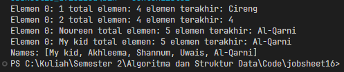
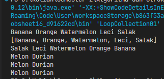
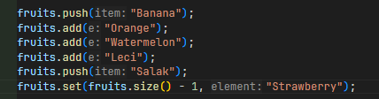
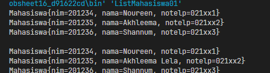
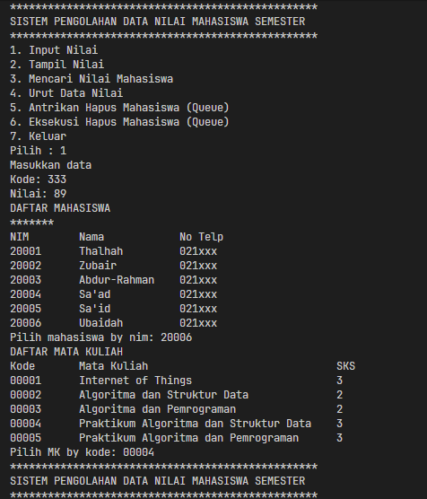
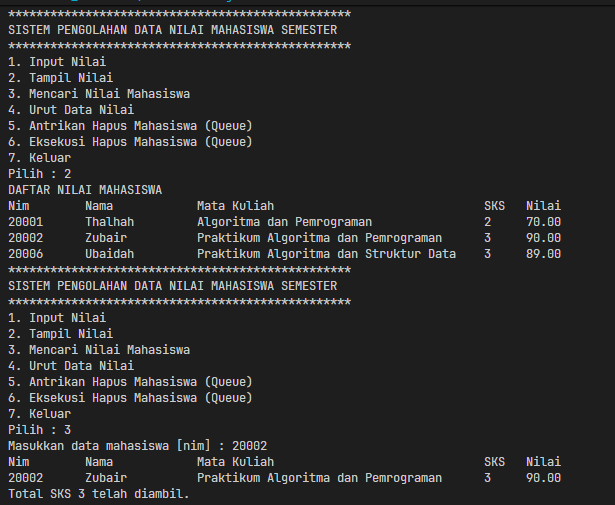
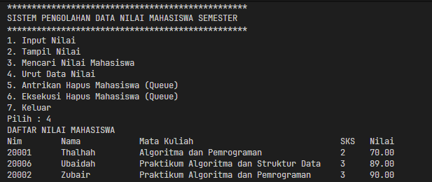
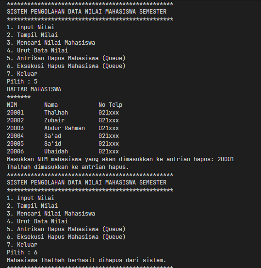
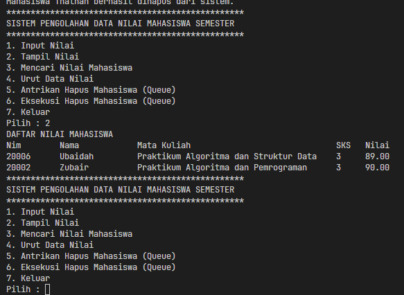

|  | Algorithm and Data Structure |
|--|--|
| NIM | 254107020229 |
| Nama | Nurfakiyah Rahmadhani |
| Kelas | TI - 1F |
| Repository | [link] (https://github.com/borzooraa/PraktikumASD/tree/main/jobsheet16) |

# Labs #16 Collection

## 16.1 Percobaan 1

### 16.1.2 Pertanyaan

1. Mengapa semua jenis data bisa ditampung ke dalam sebuah ArrayList pada baris 25-36?  
: Hal tersebut terjadi karena objek `l` dibuat tanpa mendefinisikan tipe data generik (`List l = new ArrayList();`). Akibatnya, ArrayList akan menggunakan tipe dasar `Object`, sehingga berbagai jenis data seperti `Integer`, `String`, maupun tipe lain yang merupakan turunan `Object` dapat disimpan di dalamnya.

2. Modifikasi baris kode 25-36 sehingga data yang ditampung hanya satu jenis atau spesifik tipe tertentu!  

3. Ubah names jadi linkedlist  

4. Tambahkan names.push  

5. Dari penambahan kode tersebut, silakan dijalankan dan apakah yang dapat Anda jelaskan!  
: Method `push()` merupakan bagian dari interface `Deque` yang didukung oleh class `LinkedList`. Fungsi utamanya adalah menambahkan elemen baru di posisi paling depan list (index 0). Karena itu, setelah `"Mei-mei"` ditambahkan menggunakan `push()`, elemen tersebut langsung berada di urutan pertama dan elemen lain bergeser ke belakang, sedangkan data terakhir tetap `"Al-Qarni"`.

---

## 16.2 Percobaan 2

### 16.2.1 Pertanyaan

1. Apakah perbedaan fungsi push() dan add() pada objek fruits?  
: Method `push()` digunakan khusus pada struktur data `Stack` untuk memasukkan elemen ke bagian paling atas sesuai konsep LIFO (*Last In First Out*). Sementara itu, `add()` adalah method umum dari interface `Collection` atau `List` yang berfungsi menambahkan elemen ke posisi akhir daftar.

2. Silakan hilangkan baris 43 dan 44 (`fruits.push("Melon");` dan `fruits.push("Durian");`), apakah yang akan terjadi? Mengapa bisa demikian?  
: Ketika dua baris tersebut dihapus, maka proses perulangan yang berada setelahnya tidak akan menampilkan isi data apa pun. Hal ini disebabkan karena sebelumnya semua elemen dalam stack sudah diambil keluar menggunakan method `pop()` pada perulangan `while`, sehingga stack menjadi kosong.

3. Jelaskan fungsi dari baris 46-49 (Perulangan Iterator)?  
: Kode tersebut berfungsi untuk mengakses dan menampilkan setiap elemen yang tersimpan di dalam objek `fruits` menggunakan bantuan objek `Iterator`. Method `hasNext()` digunakan untuk mengecek apakah masih ada data berikutnya, sedangkan `next()` dipakai untuk mengambil nilai elemen tersebut satu per satu.

4. Silakan ganti baris kode 25, `Stack<String>` menjadi `List<String>` dan apakah yang terjadi? Mengapa bisa demikian?  
: Program akan menghasilkan error ketika dikompilasi. Penyebabnya karena method `empty()` dan `pop()` hanya dimiliki oleh class `Stack`. Jika deklarasi diubah menjadi `List`, kedua method tersebut tidak tersedia sehingga pemanggilan method menjadi tidak valid.

5. Ganti elemen terakhir dari objek fruits menjadi "Strawberry"!  

6. Tambahkan 3 buah seperti "Mango", "guava", dan "avocado" kemudian dilakukan sorting!  

---

## 16.3 Percobaan 3

### 16.3.1 Pertanyaan

1. Pada fungsi tambah() yang menggunakan unlimited argument itu menggunakan konsep apa? Dan kelebihannya apa?  
: Fungsi tersebut menerapkan konsep **Varargs (Variable Arguments)** yang ditandai dengan penggunaan tanda tiga titik (`...`) setelah tipe data parameter. Keunggulannya adalah method dapat menerima jumlah parameter yang fleksibel, baik satu, beberapa, maupun banyak objek sekaligus tanpa perlu membuat banyak versi method atau menyiapkan array secara manual.

2. Pada fungsi linearSearch() di atas, silakan diganti dengan fungsi binarySearch() dari collection!  
: Perubahan dilakukan dengan mengganti proses pencarian linear menjadi `Collections.binarySearch()`. Agar pencarian biner dapat bekerja dengan benar, data pada list harus diurutkan terlebih dahulu menggunakan `Comparator`, kemudian proses pencarian dilakukan dengan comparator yang sama.

3. Tambahkan fungsi sorting baik secara ascending ataupun descending pada class tersebut!  
: Fungsi sorting telah ditambahkan untuk dua kondisi, yaitu ascending dan descending. Method `sortAscending()` digunakan untuk mengurutkan data berdasarkan NIM dari nilai terkecil ke terbesar, sedangkan `sortDescending()` digunakan untuk mengurutkan dari nilai terbesar ke terkecil dengan bantuan lambda expression sebagai aturan pembanding.

---

# 16.4 Tugas

