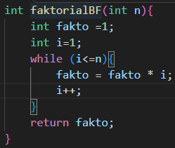
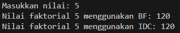
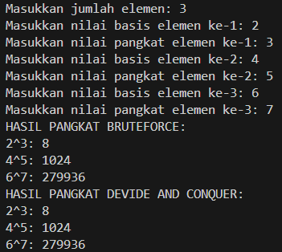
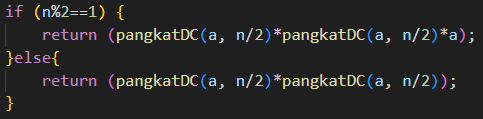
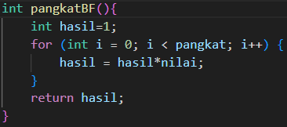
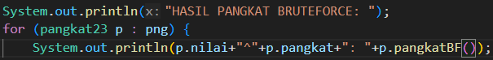
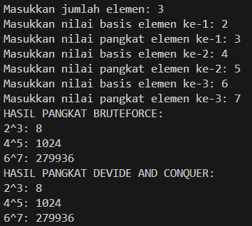
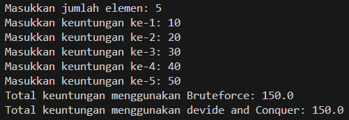
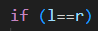
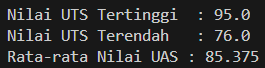

|  | Algorithm and Data Structure |
|--|--|
| NIM |  254107020229|
| Nama | Nurfakiyah Rahmadhani |
| Kelas | TI - 1F |
| Repository | [link] (https://github.com/borzooraa/PraktikumASD/tree/main/jobsheet5) |

# Labs #5 BRUTE FORCE DAN DIVIDE CONQUER

## 5.1. Percobaan 1 (Menghitung Nilai Faktorial dengan Algoritma Brute Force dan Devide and Conquer)
### 5.1.1. Hasil Percobaan 
Hasil percobaan pertama dapat dilihat pada gambar di bawah ini:

dimana hasil tersebut merupakan hasil yang sama seperti pada jobsheet.

### 5.1.2. Jawaban Pertanyaan
1. Perbedaan bagian kode penggunaan if dan else pada method faktorialDC yaitu:
- if, disebut base case yang berfungsi sebagai nilai batas dihentikanya rekursi. dimana pada kode tersebut yaitu (n==1), Jika nilai n sudah mencapai 1, maka method akan langsung mengembalikan nilai 1 karena faktorial dari 1 adalah 1.
- else, merupakan bagian rekursif, yaitu proses pemanggilan method itu sendiri dengan nilai yang lebih kecil (n-1). Pada bagian ini dilakukan perhitungan n * faktorialDC(n-1) hingga akhirnya mencapai kondisi dasar. Jadi, if berfungsi sebagai penghenti rekursi, sedangkan else berfungsi untuk menjalankan proses perhitungan secara bertahap.
2. Perulangan pada method faktorialBF() mungkin sekali untuk diubah selain menggunakan FOR, di bawah ini saya akan menggunakan perulangan WHILE dengan kode program seperti pada di bawah ini:

dengan hasil running seperti di bawah ini:

dimana hasil running menggunakan perulangan FOR ataupun WHILE tetap sama.
3. Perbedaan antara keduanya yaitu:
- fakto*=i, mulai dari angka yang paling kecil (contoh: 3!=1 x 2 x 3), selain itu pendekatannya lebih sederhana.
- fakto = n * faktorialDC(n-1), mulai dari angka yang paling besar (contoh: 3 x 2 x 1), sementara pendekatan lebih rumit dengan membagi masalah menjadi bagian yang lebih kecil.
4. Kesimpulan perbedaan cara kerja method keduanya yaitu:
- faktorialBF(), menggunakan Brute Force pendekatan looping yang lebih sederhana.
- faktorialDC(), menggunakan pendekatan Device and Conquer yang lebih rumit, dengan membagi masalah menjadi bagian yang lebih kecil

## 5.2. Percobaan 2 (Menghitung Hasil Pangkat dengan Algoritma Brute Force dan Devide and Conquer)
### 5.2.1. Hasil percobaan
Hasil running pada percobaan 2 dapat dilihat di gambar di bawah ini:

dimana hasil running sama seperti pada contoh jobsheet.

### 5.2.2. Jawaban Pertanyaan
1. Perbedaan antara method pangkatBF() dan pangkatDC() yaitu:
- pangkatBF(), melakukan pendekatan Brute Force yang menggunakan perulangan sederhana.
- PangkatDC(), melakukan pendekatan Device and Conquere, yang memecah masalah menjadi bagian lebih kecil
2. Pada kode tersebut sudah memiliki combine, yaitu pada baris di bawah ini:

dimana combine itu sendiri yaitu, proses menggabung kan solusi dari permasalahan yang kecil, untuk mendapatkan solusi akhir(substitusi)
3. Parameter pada method tersebut tidak relavan, dikarenakan meskipun tanpa menggunakan parameter, data yang diperlukan dapat di ambil dari atribut nilai dan pangkat.contoh method tersebut yang tanpa menggunakan parameter yaitu seperti pada di bawah ini:

lalu pada class mainPangkat, atribut pada perulangan pangkatBF() dihilangkan seperti pada gambar di bawah ini

kemudian hasil running pada percobaan tersebut yaitu:

dimana hasil dari method tanpa parameter tersebut sama dengan method yang berparameter.

4. Kesimpulan cara kerja antara keduanya yaitu:
- pangkatBF(), pada method tersebut melakukan pendekatan brute force yang sederhana,namun memerlukan waktu lebih lama. Hal ini dikarenakan pada metode ini melakukan perkalian satu persatu antar indeks, urut dari indeks depan sampai indeks paling belakang.
- pangkatDC(), pada method tersebut melakukan pendekatan Devine and Conquer yang membagi masalah sampai menjadi bagian terkecil, lalu menyelesaikannya dari bawah.Metode ini memerlukan kemampuan yang lebih sulit namun menghasilkan waktu pemrosesan yang lebih singkat.

## 5.3 Percobaan 3 (Menghiung Sum Array dengan Algoritma Brute Force dan Devide and Conquer)
### 5.3.1. Hasil percobaan
Hasil running pada percobaan ketiga dapat dilihat pada gambar di bawah ini:

dimana hasil running sama seperti pada jobsheet

### 5.3.2 Jawaban pertanyaan
1. Hal ini dikarenakan totalDC membagi bagian menjadi kiri dan kanang, variabel mid merupakan pemisah antara keduanya. 
2. Statement tersebut merupakan bagian ekspansi yang berfungsi untuk mencari bagian terkecil dari masalah (hingga mencapai base case)
3. Karena pada akhirnya yang dicari adalah penjumlahan dar semua elemen array. Sehingga ketika kitas sudah mendapatkan bagian terkecil dari masalah (1 elemen array saja), dia akan dijumlahkan dengan elemen di sebelah kiri atau sebelah kanannya saja.
4. Base case dari totalDC yaitu pada baris di bawah ini

dimana arti dari basecase tersebut yaitu,ketika indeks kanan dan kiri sama.

## 5.3 Tugas
### Tugas 1
Hasil running pada tugas 1 yaitu seperti pada di bawah ini

