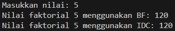

|  | Algorithm and Data Structure |
|--|--|
| NIM |  254107020229|
| Nama | Nurfakiyah Rahmadhani |
| Kelas | TI - 1F |
| Repository | [link] (https://github.com/borzooraa/PraktikumASD/tree/main/jobsheet5) |

# Labs #5 BRUTE FORCE DAN DIVIDE CONQUER

## 5.1. Percobaan 1
### 5.1.1. Hasil Percobaan
Hasil percobaan pertama dapat dilihat pada gambar di bawah ini:

dimana hasil tersebut merupakan hasil yang sama seperti pada jobsheet.

### 5.1.2. Jawaban Pertanyaan
1. Perbedaan bagian kode penggunaan if dan else pada method faktorialDC yaitu:
- if, disebut base case yang berfungsi sebagai nilai batas dihentikanya rekursi. dimana pada kode tersebut yaitu (n==1), Jika nilai n sudah mencapai 1, maka method akan langsung mengembalikan nilai 1 karena faktorial dari 1 adalah 1.
- else, merupakan bagian rekursif, yaitu proses pemanggilan method itu sendiri dengan nilai yang lebih kecil (n-1). Pada bagian ini dilakukan perhitungan n * faktorialDC(n-1) hingga akhirnya mencapai kondisi dasar. Jadi, if berfungsi sebagai penghenti rekursi, sedangkan else berfungsi untuk menjalankan proses perhitungan secara bertahap.