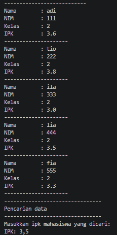
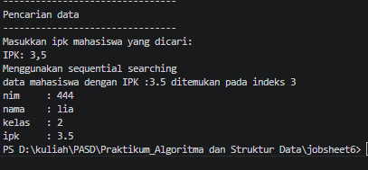
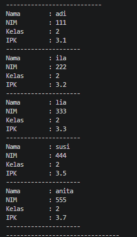
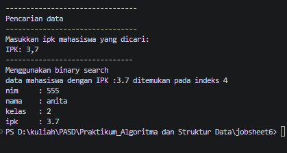
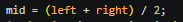
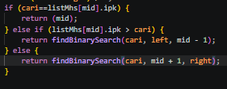
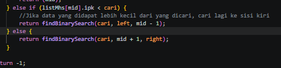
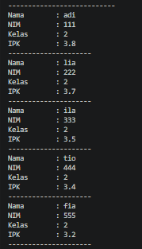
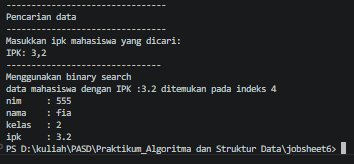

|  | Algorithm and Data Structure |
|--|--|
| NIM |  254107020229|
| Nama | Nurfakiyah Rahmadhani |
| Kelas | TI - 1F |
| Repository | [link] (https://github.com/borzooraa/PraktikumASD/tree/main/jobsheet6) |

# Labs #6 SEARCHING

## 6.1 Percobaan 1
Hasil running dari percobaan tersebut ada di bawah ini:

 ### 6.1.1 Pertanyaan
 1. Method tampilDataSearch menampilkan data hasil dari pencarian, sementara tampilPosisi menyebutkan di index berapa data yang dicari itu ditemukan
 2. break digunakan untuk menghentikan perulangan dalam proses pencarian tersebut. Sehingga, ketika data yang dicari sudah ditemukan, dia tidak akan melihat lagi data yang ada setelahnya
 3. Variabel pos yang berisi index hasil pencarian, akan digunakan oleh metode tampilSearchData untuk menampilkan data hasil cari dengan mengambil array pada index pos (sesuai hasil pencarian), pos ini juga menentukan data yang dicari ditemukan atau tidak (jika tidak nilainya -1).
 4. Jika ada lebih dari satu nilai yang sesuai dengan pencarian, maka data yang ditampilkan adalah data yang paling depan di urutan array. Ini dikarenakan ada perintah break, dimana jika data yang dicari sudah ditemukan dia akan berhenti dan tidak melihat apakah ada data yang sesuai lagi dibelakangnya.
 5. Jika perintah break dihapus, maka perulangan akan selalu dilakukan sampai akhir array. Dengan demikian, jika ada lebih dari satu data yang sesuai dengan pencarian, maka data di urutan yang paling belakang yang diambil, karena dia yang terakhir kali dilakukan operasi setelah memenuhi kondisi yang ada (nilai benar sebelumnya akan di gantikan).

## 6.2 Percobaan 2

 ### 6.2.1 Pertanyaan
 1. 

 2. 

 3. Left digunakan untuk menentukan batas kiri (awal), right menentukan batas kanan (akhir) dan mid digunakan untuk menyimpan index tengah antara left dan right yang membagi pencarian

 4. Jika data tidak urut, maka pencarian akan jadi tidak akurat, karena binary search melihat berdasarkan nilai tengah antara lebih kecil atau lebih besar dari yang dicari, yang akan menentukan dia mencari ke sisi kanan atau kiri. Data tidak urut membuatnya bisa saja mencari di sisi yang salah entah kiri atau kanan

 5. Jika data yang di input berurutan secara ascending, hasil searching tidak akan sesuai, maka perubahan yang diperlukan jika datanaya ascending adalah: 

 

 

 

 