|  | Algorithm and Data Structure |
|--|--|
| NIM |  254107020229|
| Nama | Nurfakiyah Rahmadhani |
| Kelas | TI - 1F |
| Repository | [link] (https://github.com/borzooraa/PraktikumASD/tree/main/jobsheet9) |

# Labs #9 STACK
## 9.1 Percobaan 1: Mahasiswa Mengumpulkan Tugas
### 9.1.1 Hasil verifikasi
Hasil verivikasi percobaan satu dapat dilihat di gambar di bawah ini.

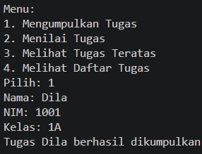

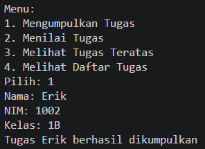

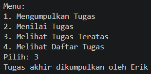

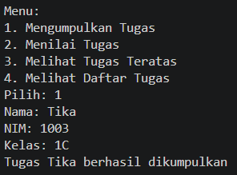

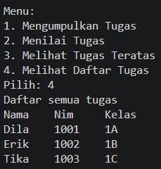

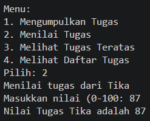

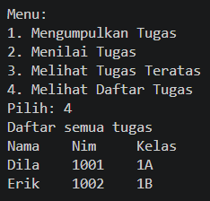

### 9.2.2 Pertanyaan
1. Bagian program yang perlu diganti terletak pada class stackTugasMahasiswa23 pada method print(), dimana yang awalnya

menjadi

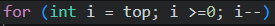

2. Banyaknya data yang ditampung yaitu ada lima, dapat dilihat di potongan program berikut:

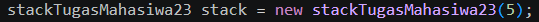

dimana 5 merupakan ukuran/size dari program yang telah dibuat

3. Perlunya pengecekan kondisi !isFull yaitu agar isi dari array stackTugasMahasiswa tidak overflow. Dan yang akan terjadi jika kondisi if-else tersebut dihapus, maka program akan mengakses indeks array yang tidak ada, yang mengakibatkan program akan error outOfBound.

4. Agar pengguna dapat melihat mahasiwa yang pertama kali mengumpulkan tugas yaitu dapat dengan menambahkan program pada class mahasiswa demo, yaitu:

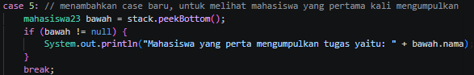 

lalu pada class yang sama menambahkan menu 5:

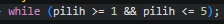 

dan juga pada class yang sama, mengganti batas seperti pada gambar di bawah ini

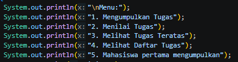

dimana penggantian batas itu dikarenakan menu sudah bertambah menjadi 5 yang awalnya cuma 4.
5. penambahan method dilakukan di class stackTugasMahasiswa23() dapat dilihat seperti pada gambar di bawah ini:

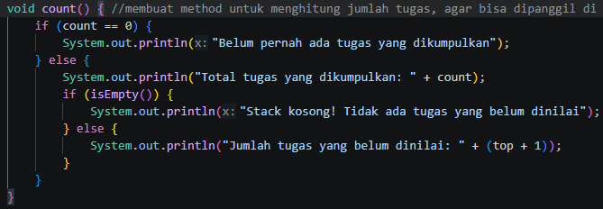

## 9.2 Percobaan 2: Konversi Nilai ke Biner
### 9.2.1 Hasil verifikasi
Hasil verifikasi percobaan 2 dapat dilihat pada gambar di bawah ini:

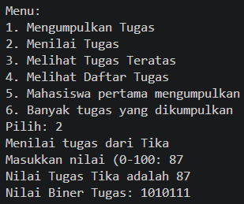

### 9.2.2 Pertanyaan
1. Alur kerja dari method konversiDesimal ke biner yaitu
- Pertama, membuat object stack biner dari class yang sudah ada.
- Kemudian melakukan perulangan dengan mengambil modulus parameter nilai ketika dibagi dua dan memasukkan ke dalam stack hingga nilai mecapai nol.
- Lalu mendeklarasikan variable string biner dan memebuat perulangan kedua. Pada perulangan kedua, mengeluarkan bilangan biner dari stack biner urut dari yang terakhir masuk, dan dimasukkan ke String biner.
- return String biner agar diterima oleh program yang memanggilnya.
2. perubahan itu tidak memberikan dampak signifikan, karena baik program yang sekaranga tau yang sebelumnya smaa-sama menghentikan perulangan ketika nilai sama dengan 0.

## Tugas
Hasil Run tugas dapat dilihat pada gambar dibawah ini

