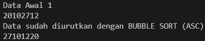
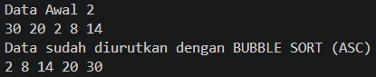
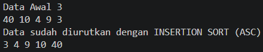
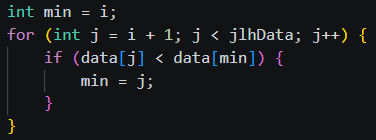
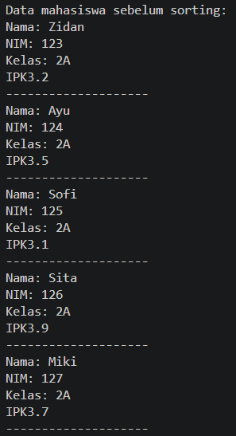
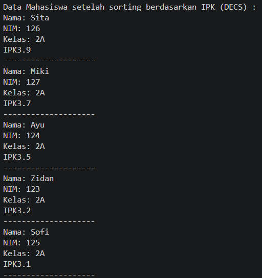

|  | Algorithm and Data Structure |
|--|--|
| NIM |  254107020229|
| Nama | Nurfakiyah Rahmadhani |
| Kelas | TI - 1F |
| Repository | [link] () |

# Labs #5 SORTING (BUBBLE, SELECTION, DAN INSERTION SORT)

## 5.1 Praktikum 1 (Mengimplementasi Sorting menggunakan object)
### a. Sorting - Bubble sort
untuk hasil percobaan "sorting - bubble sort" terdapat pada gambar di bawah ini

dimana hasil running sama dengan hasil verifikasi pada jobsheet  5

### b. Sorting - Selection Sort
untuk hasil percobaan "sorting - selection sort" terdapat pada gambar di bawah ini

dimana hasil running sama dengan hasil verifikasi pada jobsheet  5

### c. Sorting - insertion Sort
untuk hasil percobaan "sorting - insertion sort" terdapat pada gambar di bawah ini:

dimana hasil running sama dengan hasil verifikasi pada jobsheet  5

### Pertanyaan 
1. Fungsi barisan program di atas yaitu untuk menukar (swap) jika posisinya salah. dimana kondisi pada percabangan tersebut dimaksudkan untuk mengecek apakah angka kiri lebih besar dari kanan. Jika iya maka akah dilakukan pertukaran posisi antara kedua angka yang akan disimpan di temp. Dimanapertukaran ini terjadi karena artinya posisi angka tidak ascending. 
2. Kode program yang merupakan algoritma pencarian nilai minimum pada selection sort yaitu terdapa pada:

dimana mkita menetapkan dulu bahwa indeks ke-i adalah nilai terkecil dengan min=i. Kemudian loop j mencari yang lebih kecil dibandingkan dengan i atau data sebelumnya. jika ditemukan data yang lebih kecil, maka min diganti dengan indeks nilai yang lebih kecil.
3. Maksud dari kondisi perulangan tersebut yaitu sebagai batas agar nilai  nilai yang disisipkan tidak keluaar dari batas array dan juga untuk mengecek apakah data lebih besar dari nilai yang akan disisippkan. Jika kedua kondisi benar maka data akan digeser ke kanan
4. Tujuan dari perintah tersebut yaitu, untuk menggeser elemen ke kanan dan memberikan ruang untuk memasukkan temp ke tempat yang benar

## 5.2 Praktikum 2 (Sorting Menggunakan Array of Object)
### a. P21
Untuk hasil P21 dapat dilihat pada gambar di bawah ini:

Merupakah hasil yang sama sepertihasil verivikasi pada pada jobsheets

### Pertanyaan 
1. Soal
a. Karena pada bubble sort, setiap perulangan akan menempatkan 1 data terbesar ke posisi akhir.
Jumlah maksimal perulangan yang dibutuhkan adalah n-1 kali (n = jumlah data), karena jika sudah n-1 kali, data pasti sudah terurut semua.
Jadi, tidak perlu sampai length, cukup dengan length -1
b. Karena setiap perulangan ke-i, bagian akhir array sudah terurut.Jadi, tidak perlu dibandingkan lagi.
c. Baik perulangan i maupun tahapan bubble sort berjumlah 49 kali